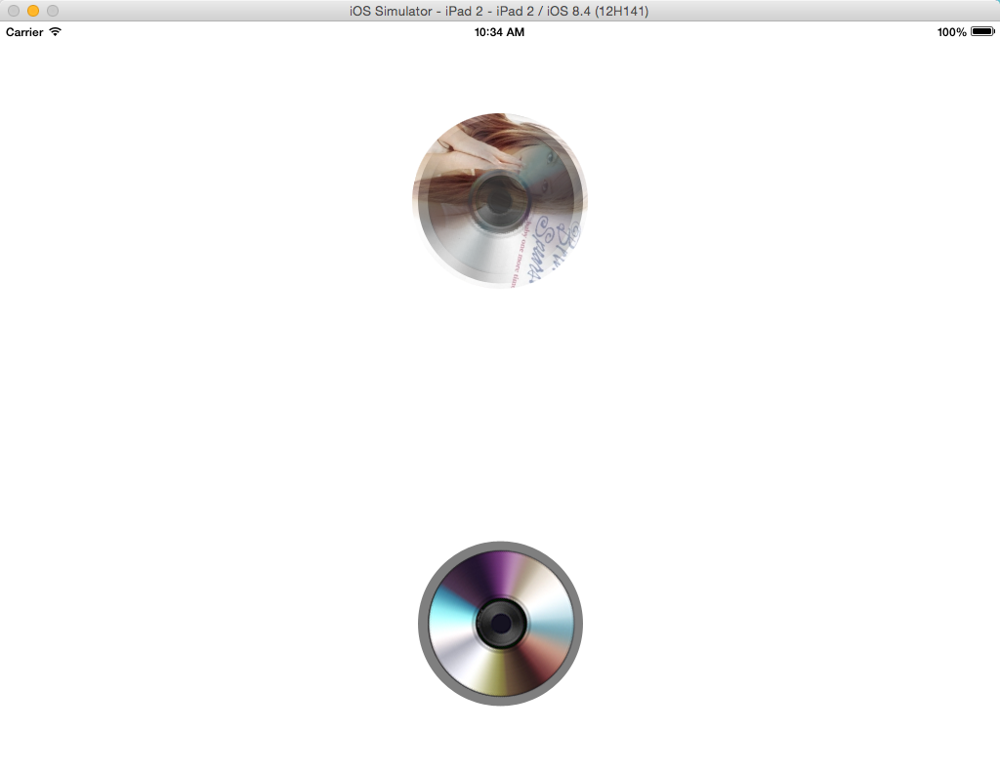

CDAlbumView

A IOS View Controller for displaying a rotating  music album picture.

## Screenshot

##How to Use

1. Init  a instanse  
`self.albumViewController1 = [CDAlbumViewController CDAlbumWithStoryBoard];`

2. Set a album url  
`[self.albumViewController1 setAlbumImageUrl:[[NSBundle mainBundle] URLForResource:@"b" withExtension:@"jpg"]];`  

3. Add to your view  
`[self.albumViewController1 addToView:self.placeHolder1];`  
    
