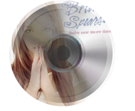

#CDAlbumView

A IOS View Controller for displaying a rotating music album picture.

## Installation with CocoaPods

CocoaPods is a dependency manager for Objective-C, which automates and simplifies the process of using 3rd-party libraries like AFNetworking in your projects. See the "Getting Started" guide for more information.    
Podfile

platform :ios, '6.0'  
pod "CDAlbumView"

##How to Use

1. Init  a instanse  
`self.albumViewController1 = [CDAlbumViewController CDAlbumWithStoryBoard];`

2. Set a album url  
`[self.albumViewController1 setAlbumImageUrl:[[NSBundle mainBundle] URLForResource:@"b" withExtension:@"jpg"]];`  

3. Add to your view and let starting rotation.  
`[self.albumViewController1 addToView:self.placeHolder1];`  

## Screenshot

    
